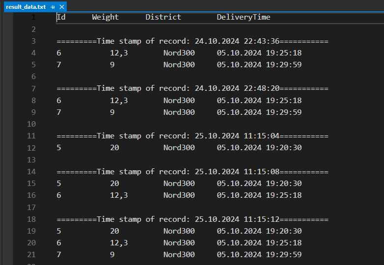
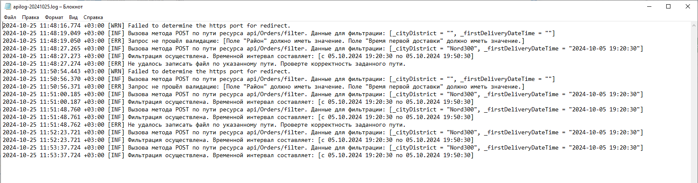

# DeliveryGrig.Api
Проект по ТЗ .NET Junior выполнен в виде Web Api. Основная функциональность приложения содержится в контроллере OrdersController и в классах фильтрации и валидации OrderFilter, OrderFilterValidatorи в классе контекста данных DataContext.\
Источник данных файл init_data.csv (wwwroot/datafiles/init_data.csv).\
Валидация районов происходит по принципу имеющегося списка существующих районов, который генерируется на лету.\

## Решение по ТЗ .NET Junior от компании "Effective Mobile".
**Инструкция по настройке и проверке работы приложения в ОС Windows 10 (должны быть установлены .NET 8 и модуль AspNetCoreModule):**
1. Клонируйте (или скачайте архивом) мой репозиторий DeliveryGrig.Api
2. Разархивируйте DeliveryApiRelease.zip и перенесите папку DeliveryApiRelease на системный диск
3. Откройте Диспетчер служб IIS
4. В открывшемся окне, щёлкнув правой кнопкой мыши по папке "сайты", выберите "добавить веб-сайт..."
5. Задайте название, путь до папки с приложением, и свободный порт, например: 8800. Нажмите Ок.
6. Через браузер обратитесь по адресу http://localhost:8800 (или выбранный вами порт) 
7. Можете протестировать приложение на имеющихся данных из списка
8. Путь к месту сохранения результата выборки для фильтрации можно задать через конфигурационный файл appsetings.json в папке с проектом (значение для PathToResultRecords:_deliveryOrder)
9. Через конфиг. файл appsetings.json можно установить значения для паравметров запроса FilteringParams:_cityDistrict и FilteringParams:firstDeliveryDateTime. В этом случае будут игнорироваться параметры пришедшие от клиента-браузера.
10. Все операции и ошибки логируются в файл с приложением по пути ./logs/apilog-yyyyMMdd.log(новый файл создаётся ежедневно). Путь для логирования меняется в appsetings.json в Serilog:WriteTo:Args:path
 
Скриншот главной страницы сайта, для удобного тестирования REST api:

Скриншот результирующей выборки:

Скриншот логов:

